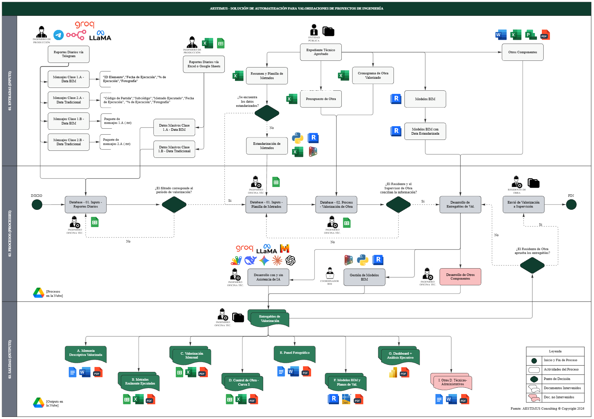

<div align="center">


</div>

<div align="center">

[](https://n8n.io)
[](https://groq.com)
[](https://autodesk.com)
[](https://core.telegram.org/bots)
[](https://python.org)
[](https://drive.google.com)
[](https://powerbi.microsoft.com)
[](LICENSE)

<br/>

**AESTIMUS** es un sistema de integración de datos basado en mensajería que automatiza el flujo de valorizaciones de obra en proyectos de inversión pública en el Perú — integrando captura de campo, modelos BIM, orquestación con IA y generación automática de entregables.

<br/>

[**Resultados**](#-resultados) · [**Arquitectura**](#️-arquitectura) · [**Entregables**](#-entregables-del-sistema) · [**Stack**](#-stack-tecnológico) · [**Equipo**](#-equipo)

<br/>

---

</div>

<br/>

## ¿Qué es AESTIMUS?

En el Perú, la valorización de obra es el instrumento técnico-administrativo mediante el cual se reporta el avance ejecutado y se sustenta el pago al contratista. En la práctica, el proceso concentra una de las mayores fuentes de ineficiencia del sector: el Ingeniero de Producción recopila datos de campo en reportes dispersos, la Oficina Técnica los organiza partida por partida en hojas de cálculo independientes, y cada conciliación entre Residente, Supervisor y Entidad implica múltiples rondas de revisión — generando inconsistencias documentales, retrasos y riesgo real de controversia contractual.

**AESTIMUS** resuelve esta fragmentación.

Es una arquitectura de procesamiento automatizado que integra reportes de campo vía **Telegram**, modelos **BIM**, y **flujos orquestados con IA** en un pipeline continuo y trazable. No opera de forma lineal, sino como un **flujo condicional con puntos de decisión técnica** — arquitectura híbrida entre automatización determinística y sistemas agénticos — que genera automáticamente los entregables de valorización con mínima intervención manual.

```
Telegram (campo) → BOT Aestimus (n8n + LLAMA 3.1) → Google Sheets/Drive → 7 entregables
```

> Publicado en **AI TALENT | Programa de Entrenamiento en IA y Herramientas Digitales para el Sector AEC**
> Ed. No. 01, Abril 2026 · Lima, Perú · Licencia CC BY 4.0

<br/>

---

## 🎯 El Problema que Resolvemos

Las deficiencias en la gestión de **valorizaciones de obra** generan una cadena directa de consecuencias en la inversión pública peruana:

<div align="center">

| Problemática en Valorizaciones | Consecuencia Directa |
|:---|:---:|
| 🔴 Metrados cuantificados sin sustento documentado | Observaciones de Contraloría · Pagos indebidos |
| 🔴 Baja interoperabilidad entre modelo BIM, avance de campo y sistema de pago | Fragmentación · Duplicidad de esfuerzos |
| 🔴 Proceso 100% manual: campo → oficina técnica → supervisor → entidad | 16 horas por ciclo de valorización |
| 🔴 Desalineación entre avance físico y financiero en expedientes | Inconsistencias · Reprocesos · Retrasos |
| 🔴 Limitada trazabilidad entre fuentes y entregables | Controversias contractuales · Arbitrajes |

</div>

> Al cierre de 2024 existen **2,476 obras públicas paralizadas** con más de **S/ 43,118 millones** inmovilizados en el Perú. Una causa estructural recurrente: la deficiente trazabilidad del control físico-financiero en etapa de ejecución, que desemboca en controversias y arbitrajes.

<br/>

---

## 🏗️ Arquitectura

El sistema no opera como una secuencia lineal, sino como un **flujo condicional con puntos de decisión técnica** — arquitectura híbrida entre automatización determinística y sistemas agénticos. Se organiza en tres capas articuladas mediante **bases de datos intermedias (L0 → L1 → L2)** y almacenamiento centralizado en **Google Drive**.

<div align="center">



*Figura 1. Arquitectura General del Sistema AESTIMUS · Fuente: AESTIMUS Consulting © 2026*

</div>

<br/>

> ⚠️ **Para que la imagen aparezca:** sube el archivo `arquitectura_aestimus.png` a la **raíz** de tu repositorio en GitHub.

<br/>

---

## 📦 Entregables del Sistema

El sistema genera automáticamente **7 entregables técnicos estandarizados** por cada valorización mensual, listos para presentación ante la entidad y registro en el SEACE:

<div align="center">

| Cód. | Entregable | Descripción Técnica | Formatos |
|:---:|:---|:---|:---:|
| `A` | **Memoria Descriptiva Valorizada** | Documento narrativo que describe y sustenta los trabajos ejecutados | `.docx` `.pdf` |
| `B` | **Metrados Realmente Ejecutados** | Cuantificación detallada de partidas ejecutadas en el período | `.xlsx` `.pdf` |
| `C` | **Valorización Mensual** | Cálculo económico del avance de obra con precios unitarios contractuales | `.xlsx` `.pdf` |
| `D` | **Control de Obra — Curva S** | Análisis del avance físico-financiero vs. programado acumulado | `.xlsx` `.pdf` |
| `E` | **Panel Fotográfico** | Registro visual estructurado del avance en campo por partida | `.docx` `.pdf` |
| `F` | **Modelos BIM y Planos de Valorización** | Representación digital del estado real de obra y planos técnicos | `.rvt` `.pdf` `.dwg` |
| `G` | **Dashboard y Análisis Ejecutivo** | Visualización de indicadores y síntesis para toma de decisiones | `.pbix` `.pdf` |

</div>

<br/>

---

## 📊 Resultados

> Proyecto piloto **I.E. Fe y Alegría N.° 23** · Villa María del Triunfo, Lima · S/ 13,113,956.86 · 334 días calendario
> Método Tradicional (línea base histórica) vs. Sistema AESTIMUS (Valorización N.° 08 — primera ejecución completa)

<br/>

<div align="center">


</div>

<br/>

<div align="center">

**📌 Indicadores Principales**

| Indicador | Tradicional | AESTIMUS | Δ Variación |
|:---|:---:|:---:|:---:|
| ⏱️ **(TP)** Tiempo de Procesamiento | 16 h | 8 h | **↓ 50.0 %** |
| 🖐️ **(IIM)** Índice de Intervención Manual | 90 % | 21 % | **↓ 76.7 %** |
| 📋 **(ICD)** Índice de Consistencia Documental | 75 % | 97 % | **↑ +22 p.p.** |
| 💰 **(COV)** Costo Operativo de Valorización | S/. 1,900 | S/. 787.52 | **↓ 58.6 %** |

**📌 Indicadores Complementarios**

| Indicador | Tradicional | AESTIMUS |
|:---|:---:|:---:|
| 👥 **(NP)** Profesionales involucrados | 5 personas | 3 personas |
| 🤖 **(NA)** Nivel de Automatización | Básico e Ineficiente `(1/4)` | Alto y Eficiente `(3/4)` |

*pp = puntos porcentuales · Gráfico normalizado: Tradicional = 100 en TP, IIM y COV · ICD muestra valor absoluto*

</div>

<br/>

---

## 💻 Stack Tecnológico

<div align="center">

| | Tecnología | Rol en el Sistema |
|:---:|:---|:---|
| 📱 | **Telegram Bot API** | Interfaz de captura — 4 tipos de mensajes estructurados desde campo (1A, 2A, 1B, 2B) |
| ⚡ | **n8n** | Motor del BOT Aestimus — orquestación del pipeline ETL completo |
| 🤖 | **LLAMA 3.1 vía Groq** | Clasificación semántica de mensajes · Generación de Memoria Descriptiva · Panel Fotográfico |
| 🏗️ | **Autodesk Revit** | Modelo BIM con parámetros AC_ para control y valorización de obra |
| 🔁 | **Dynamo** | Scripts de asignación y extracción automática de parámetros BIM a Excel |
| 🐍 | **Python** | Transformación de datos y asignación masiva de parámetros en elementos Revit |
| 📊 | **Google Sheets** | Capas de datos L0 · L1 · L2 — consolidación y plantillas de cálculo automatizadas |
| ☁️ | **Google Drive** | Almacenamiento cloud centralizado — backbone de disponibilidad y trazabilidad |
| 📈 | **Power BI** | Dashboard ejecutivo de indicadores físico-financieros (`.pbix`) |

</div>

<br/>

---

## 📈 Actividad

<div align="center">

[](https://git.io/streak-stats)

<br/>


</div>

<br/>

---

## 👥 Equipo

<div align="center">

| Integrante | Rol | Universidad |
|:---|:---|:---:|
| **Alexander Daniel Cristobal Taquire** | Jefe de Proyecto — Gestión de Información de Valorizaciones | Universidad Privada del Norte |
| **Yasser Nasser Ladera Gavilan** | Jefe de Automatización e Inteligencia Artificial | Universidad Peruana de Ciencias Aplicadas |
| **Milagros Raquel Gómez M.** | Jefa BIM — Coordinación e Integración de Información | Pontificia Universidad Católica del Perú |
| **Eddy Luis Mamani Cusi** | Analista de Optimización — Procesos con IA | Universidad Peruana Unión |

<br/>

[](https://github.com/eddyluismamanicusi-netizen)

</div>

<br/>

---

## 📄 Licencia

Distribuido bajo la licencia **Creative Commons Attribution 4.0 International (CC BY 4.0)**.
Permite compartir y adaptar el material para cualquier propósito, con reconocimiento de autoría.
Ver [`LICENSE`](LICENSE) para más información.

---

<div align="center">


**AESTIMUS** · Construido en Perú 🇵🇪 · © 2026 AESTIMUS Consulting S.A.C.

*Publicado en AI TALENT — Programa de Entrenamiento en IA y Herramientas Digitales para el Sector AEC*

[](https://github.com/eddyluismamanicusi-netizen/AESTIMUS-Consulting)

</div>


