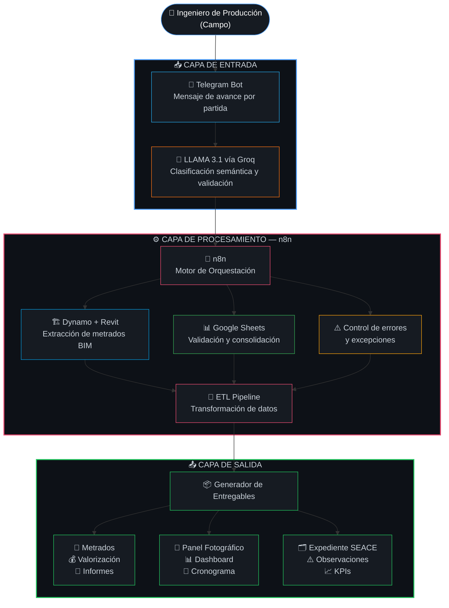

<div align="center">


</div>

<div align="center">

[](https://n8n.io)
[](https://groq.com)
[](https://autodesk.com)
[](https://core.telegram.org/bots)
[](https://github.com/eddyluismamanicusi-netizen/AESTIMUS-Consulting)
[](LICENSE)

<br/>

**AESTIMUS** es un sistema de automatización inteligente que transforma el proceso de valorización de obras públicas en el Perú — de 4 días de trabajo manual a 1 día completamente automatizado.

<br/>

[**Ver Resultados**](#-resultados) · [**Arquitectura**](#️-arquitectura) · [**Entregables**](#-entregables-del-sistema) · [**Stack**](#-tecnologías)

<br/>

---

</div>

<br/>

## ¿Qué es AESTIMUS?

El proceso de valorización de obras en el Perú concentra una de las mayores fuentes de ineficiencia en la gestión de inversión pública. Metrados cuantificados manualmente, hojas de cálculo desconectadas, múltiples rondas de revisión entre el residente, supervisor y entidad — y al final: retrasos, inconsistencias y riesgo de controversia contractual.

**AESTIMUS** elimina ese ciclo.

Es un sistema de integración de datos basado en mensajería que captura el avance de obra directamente desde campo vía Telegram, lo procesa con inteligencia artificial y genera automáticamente los **9 entregables técnicos** de una valorización — sin intervención manual en el flujo.

```
Ingeniero en campo → Telegram → IA → n8n + BIM → 9 entregables listos
```

> Desarrollado y validado por **AESTIMUS Consulting** en el contexto de proyectos de inversión pública peruanos.

<br/>

---

## 🎯 El Problema que Resolvemos

<div align="center">

| Situación actual en el Perú | Impacto |
|:---|:---:|
| 🔴 2,476 obras públicas paralizadas al cierre de 2024 | **S/ 43,118 M** inmovilizados |
| 🔴 Plazos extendidos hasta un 524.2% del plazo original | Controversias y arbitrajes |
| 🔴 Valorizaciones formuladas sin sustento de metrados | Observaciones de Contraloría |
| 🔴 Proceso 100% manual entre campo, oficina técnica y supervisión | 4 días por valorización |

</div>

La raíz del problema es estructural: **no existe interoperabilidad** entre el modelo BIM del proyecto, el seguimiento de avance en campo y el sistema de gestión de pagos. AESTIMUS cierra esa brecha.

<br/>

---

## 🏗️ Arquitectura



<br/>

---

## 📦 Entregables del Sistema

Cada ciclo de valorización produce automáticamente **9 documentos técnicos estandarizados**, listos para presentación ante la entidad y registro en el SEACE:

<div align="center">

| # | Entregable | Descripción |
|:---:|:---|:---|
| `01` | **Planilla de Metrados** | Cómputo métrico automático por partida desde modelo BIM |
| `02` | **Valorización de Obra** | Aplicación de precios unitarios según contrato |
| `03` | **Informe Descriptivo** | Narrativa técnica del avance ejecutado en el período |
| `04` | **Panel Fotográfico** | Registro gráfico organizado por partida ejecutada |
| `05` | **Dashboard Ejecutivo** | Indicadores de avance físico-financiero consolidados |
| `06` | **Control de Cronograma** | Comparativo programado vs. real del período |
| `07` | **Expediente de Valorización** | Consolidación documental para registro SEACE |
| `08` | **Reporte de Observaciones** | Inconsistencias detectadas con trazabilidad completa |
| `09` | **Informe de KPIs** | Indicadores de desempeño operativo del período |

</div>

<br/>

---

## 📊 Resultados

> Validado en el proyecto **I.E. Fe y Alegría N.º 23** · AESTIMUS Consulting
> Comparación directa: flujo manual (Feb 2026) vs. AESTIMUS automatizado (Mar 2026)

<br/>

<div align="center">

<!-- 
  Gráfico normalizado: Método Manual = 100% (baseline) en todos los indicadores de reducción.
  AESTIMUS muestra el % que representa respecto al baseline manual.
  Tiempo:         1/4   dias  = 25%   (↓ 75%)
  Errores:        2/7         = 28.6% (↓ 71.4%)
  Intervenciones: 19/94       = 20.2% (↓ 79.8%)
  Consistencia:   58% → 96%  (único indicador que sube — se muestra valor absoluto)
  Costo:          800/1600    = 50%   (↓ 50%)
-->


</div>

<br/>

<div align="center">

| Indicador | Método Manual | AESTIMUS | Reducción |
|:---|:---:|:---:|:---:|
| ⏱️ Tiempo de procesamiento | 4 días hábiles | 1 día hábil | **↓ 75.0 %** |
| ❌ Errores e inconsistencias | 7 observaciones | 2 observaciones | **↓ 71.4 %** |
| 🖐️ Intervenciones manuales | 94 por valorización | 19 por valorización | **↓ 79.8 %** |
| 📋 Consistencia documental | 58 % | 96 % | **↑ 38 p.p.** |
| 💰 Costo operativo | S/ 1,600 | S/ 800 | **↓ 50.0 %** |

</div>

<br/>

---

## 💻 Tecnologías

<div align="center">

|  | Tecnología | Función |
|:---:|:---|:---|
| 📱 | **Telegram Bot API** | Captura estructurada de avance desde campo |
| 🤖 | **LLAMA 3.1 vía Groq** | Clasificación semántica y validación de mensajes |
| ⚙️ | **n8n** | Orquestación de flujos ETL y automatización de salidas |
| 🏗️ | **Autodesk Revit** | Modelo BIM fuente de metrados y geometría |
| 🔁 | **Dynamo** | Scripts de extracción automática desde modelos BIM |
| 📊 | **Google Sheets** | Capa de datos y consolidación de información |

</div>

<br/>

---

## 📈 Actividad

<div align="center">

[](https://git.io/streak-stats)

<br/>


</div>

<br/>

---

## 👥 Equipo

<div align="center">

| Investigador | Universidad |
|:---|:---:|
| Alexander Cristobal | Universidad Privada del Norte |
| Yasser Ladera | Universidad Peruana de Ciencias Aplicadas |
| Milagros Gómez | Pontificia Universidad Católica del Perú |
| Eddy Mamani | Universidad Peruana Unión |

<br/>

[](https://github.com/eddyluismamanicusi-netizen)

</div>

<br/>

---

## 📄 Licencia

Distribuido bajo la licencia **MIT**. Ver [`LICENSE`](LICENSE) para más información.

---

<div align="center">


**AESTIMUS** · Construido en Perú 🇵🇪 · © 2026 AESTIMUS Consulting

[](https://github.com/eddyluismamanicusi-netizen/AESTIMUS-Consulting)

</div>
